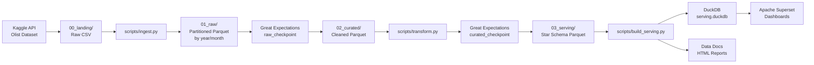

# Data Lineage - Olist E-commerce Data Lake

## Architecture Overview

## Detailed Flow

### 1. Ingestion (`scripts/ingest.py`)
- **Source**: Kaggle `olistbr/brazilian-ecommerce` dataset (9 CSV files, ~100MB)
- **Process**: 
  - Download via `kagglehub`
  - Read each CSV with pandas
  - Partition by date columns (year/month) where applicable
  - Write to `01_raw/{entity}/year=YYYY/month=MM/` as Snappy-compressed Parquet
  - Generate JSON Schema in `catalog/schemas/{entity}.json`
- **Output**: Partitioned Parquet files, schemas
- **Quality Gate**: `raw_checkpoint` validates row counts, schemas, nulls

### 2. Transformation (`scripts/transform.py`)
- **Source**: `01_raw/` partitioned Parquet
- **Process**:
  - Read full partitioned datasets
  - Apply entity-specific cleaning:
    - Standardize ZIP codes (5-digit zero-padded)
    - Title-case city names, uppercase state codes
    - Parse timestamps, derive delivery metrics
    - Handle missing values, remove duplicates
  - Write single-file Parquet per entity to `02_curated/`
- **Output**: Cleaned, typed Parquet files
- **Quality Gate**: `curated_checkpoint` validates business rules, FK integrity

### 3. Serving Layer (`scripts/build_serving.py`)
- **Source**: `02_curated/` curated Parquet
- **Process**:
  - Build dimension tables (customers, sellers, products, geolocation, date)
  - Build fact tables (orders, order_items) with joins and aggregations
  - Write to `03_serving/` as Parquet
  - Create DuckDB database with views over Parquet files
- **Output**: Star schema ready for BI, DuckDB database
- **Quality Gate**: Row count reconciliation, sum checks

### 4. Visualization (`scripts/superset_init.py`)
- **Source**: DuckDB database (`serving.duckdb`)
- **Process**:
  - Configure DuckDB connection in Superset via REST API
  - Register datasets for each serving table
  - Create charts (GMV, orders, delivery, reviews, categories)
  - Assemble dashboard
- **Output**: Superset dashboard with KPIs

## Data Contracts

### Between Layers
| From | To | Contract |
|------|----|----------|
| Kaggle | 01_raw | Schema stability, partitioning by date |
| 01_raw | 02_curated | All raw columns preserved + derived columns |
| 02_curated | 03_serving | All FKs valid, aggregates reconcilable |

### Quality Gates
| Checkpoint | Tables | Key Expectations |
|------------|--------|------------------|
| raw_checkpoint | All 9 tables | Row counts, required columns, PK uniqueness, value ranges |
| curated_checkpoint | All 9 tables | Business rules, FK references, derived column validity |

## Refresh Cadence
- **Ingestion**: On-demand (historical dataset, no incremental updates)
- **Transform**: After ingestion
- **Validate**: After each layer
- **Serve**: After validation passes
- **Dashboard**: Auto-refreshes from DuckDB (query-time)

## Recovery Points
- `00_landing/`: Original CSV (immutable)
- `01_raw/`: Partitioned Parquet (reprocessable)
- `02_curated/`: Cleaned Parquet (reprocessable from raw)
- `03_serving/`: Star schema (rebuildable from curated)
- DuckDB: Rebuildable from serving Parquet
- Superset: Reconfigurable from DuckDB