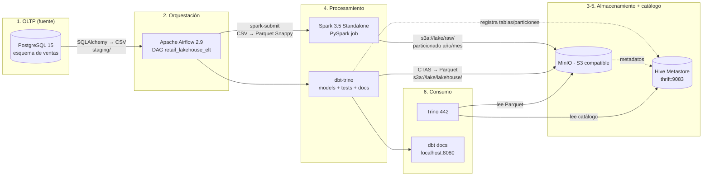

# Arquitectura — RetailLakehouse-ELT

## 1. Vista general

## 2. Zonas del lakehouse

| Zona | Ruta en MinIO | Formato | Propietario | Contenido |
|---|---|---|---|---|
| `staging/` | `s3a://staging/postgres/olist/<tabla>/ingest_date=YYYY-MM-DD/` | CSV | extract (Python) | Copia cruda del OLTP, inmutable por día |
| `lake/raw/` | `s3a://lake/raw/<tabla>/` | Parquet + Snappy | Spark | Datos tipados, deduplicados y particionados (`order_year`, `order_month`) |
| `lake/staging/` | `s3a://lake/staging/` | Vistas | dbt | Modelos de limpieza (`stg_*`) e intermedios (`int_*`) |
| `lake/lakehouse/` | `s3a://lake/lakehouse/` | Parquet | dbt | Modelos analíticos: `fct_orders`, `dim_*`, `agg_*`, cohortes |

## 3. Secuencia de una ejecución

1. **`extract_postgres_to_minio`** — SQLAlchemy lee cada tabla por *chunks* y escribe CSV en `staging/`.
   Publica un `manifest.json` con filas y bytes por tabla (auditoría / cuadratura).
2. **`spark_csv_to_parquet`** — `SparkSubmitOperator` lanza `raw_to_parquet.py` en el cluster standalone.
   Aplica el esquema declarado, deduplica por PK, añade `order_year`/`order_month` y escribe Parquet con
   `partitionOverwriteMode=dynamic` (solo reescribe las particiones del lote → idempotente).
3. **`sync_raw_partitions`** — vía cliente de Trino ejecuta
   `CALL hive.system.sync_partition_metadata('raw', '<tabla>', 'ADD')`, el equivalente a `MSCK REPAIR TABLE`:
   el Hive Metastore queda actualizado con las particiones nuevas.
4. **`check_raw_not_empty`** — smoke test: falla el DAG si la zona raw quedó vacía.
5. **`dbt_seed` → `dbt_run` → `dbt_test` → `dbt_docs_generate`** — dbt materializa staging como vistas y marts
   como tablas Parquet gestionadas; ejecuta ~40 tests (unique, not_null, relationships, accepted_values,
   rangos y dos tests singulares de cuadratura) y regenera el sitio de documentación.

## 4. Decisiones de diseño (y por qué)

| Decisión | Alternativa descartada | Motivo |
|---|---|---|
| **dbt-trino** en lugar de dbt-spark | dbt-spark vía Thrift Server | Trino ya es el motor de consulta del lakehouse: un solo punto de conexión, sin mantener un Spark Thrift Server extra. El mismo SQL compila para Athena/Starburst. |
| Spark escribe **ficheros**, el metastore se sincroniza desde Trino | `saveAsTable` con el catálogo Hive de Spark | Desacopla el productor (Spark) del catálogo. `sync_partition_metadata` es el patrón estándar cuando los ficheros los escribe un proceso externo. |
| Parquet particionado por `order_year/order_month` | Partición por día | El 90 % de las consultas analíticas filtran por mes; evita *small files*. Las tablas sin dimensión temporal no se particionan. |
| Metastore y metadata de Airflow en el mismo Postgres | Tres instancias | Ahorro de RAM en local. En producción irían separados (ver limitaciones). |
| Extracción incremental opcional por ventana `[ds, ds+1)` | `SELECT *` siempre | Permite reproducir el comportamiento de una carga diaria real sin duplicar ni perder registros. |
| Datos sintéticos generados con semilla | Descargar Olist de Kaggle | El repo arranca sin credenciales de Kaggle; el esquema es idéntico, así que basta con copiar los CSV reales en `data/raw/`. |

## 5. Limitaciones conocidas (hablar de ellas en la entrevista suma puntos)

- El stack levanta 10 contenedores: requiere ~8 GB de RAM libres. Se puede recortar quitando el worker de Spark.
- Spark corre en modo *standalone* de 1 worker (2 cores / 2 GB), suficiente para el demo; en producción sería
  EMR / Dataproc / Kubernetes con autoscaling.
- El metastore usa PostgreSQL sin alta disponibilidad y comparte instancia con Airflow.
- No hay capa de tablas transaccionales (Iceberg/Delta): la escritura es *overwrite* de partición. El siguiente
  paso natural del proyecto es migrar `lakehouse/` a **Apache Iceberg** con Trino, lo que habilitaría
  *time travel*, *schema evolution* y MERGE incremental.
- No hay secret manager: las credenciales están en variables de entorno (aceptable para un demo local).
