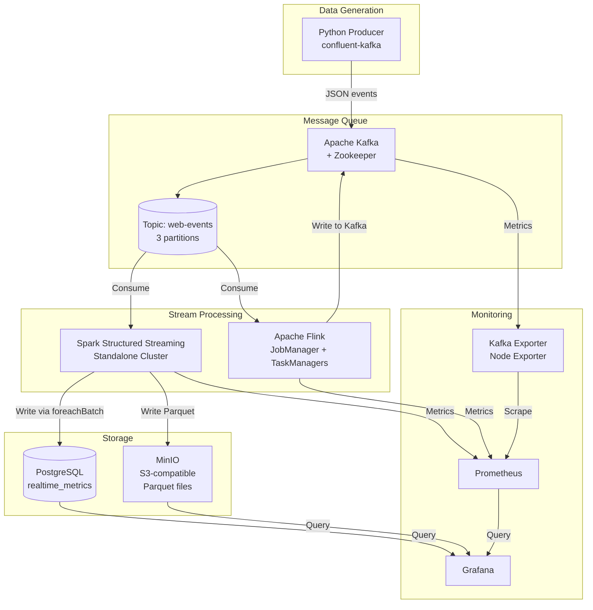

# 🚀 Real-time Streaming Pipeline: Kafka + Spark Structured Streaming + Flink + MinIO + Grafana/Prometheus

A production-ready streaming data pipeline demonstrating modern data engineering practices with Apache Kafka, Spark Structured Streaming, Apache Flink, MinIO, PostgreSQL, Grafana, and Prometheus.

## 📋 Table of Contents
- [Architecture](#-architecture)
- [Features](#-features)
- [Tech Stack](#-tech-stack)
- [Quick Start](#-quick-start)
- [Project Structure](#-project-structure)
- [Components](#-components)
- [Monitoring & Visualization](#-monitoring--visualization)
- [Testing](#-testing)
- [Troubleshooting](#-troubleshooting)
- [Contributing](#-contributing)

---

## 🏗️ Architecture



### Data Flow Description

1. **Producer** generates realistic web clickstream events (page views, clicks, purchases, etc.) every 200ms
2. **Kafka** buffers events in the `web-events` topic (3 partitions for parallelism)
3. **Spark Structured Streaming** consumes events, applies 1-minute sliding window (30s slide), aggregates by page & event type
4. **Flink** (optional) provides alternative processing with exactly-once semantics
5. **MinIO** stores aggregated metrics as partitioned Parquet files (year/month/day/hour/minute)
6. **PostgreSQL** stores latest aggregates for fast ad-hoc queries and dashboards
7. **Prometheus** scrapes metrics from all components (Kafka, Spark, Flink, MinIO, Node)
8. **Grafana** visualizes real-time dashboards from PostgreSQL, MinIO, and Prometheus

---

## ✨ Features

- ✅ **Real-time event generation** with realistic web clickstream data
- ✅ **Apache Kafka** as durable, scalable message backbone
- ✅ **Dual stream processing**: Spark Structured Streaming + Apache Flink
- ✅ **Sliding window aggregations** (1min window, 30s slide) with watermarks
- ✅ **Multi-sink output**: MinIO (Parquet) + PostgreSQL (real-time queries)
- ✅ **Exactly-once processing** with checkpointing
- ✅ **Comprehensive monitoring**: Prometheus + Grafana dashboards
- ✅ **Consumer lag tracking** via Kafka Exporter
- ✅ **Infrastructure metrics**: CPU, Memory, Network, Disk
- ✅ **Single-command deployment** with Docker Compose
- ✅ **Production-ready configurations** for all components

---

## 🛠️ Tech Stack

| Component | Version | Purpose |
|-----------|---------|---------|
| Apache Kafka | 7.5.0 | Message broker |
| Apache Zookeeper | 7.5.0 | Kafka coordination |
| Apache Spark | 3.5.0 | Structured Streaming |
| Apache Flink | 1.18.1 | Alternative stream processor |
| MinIO | 2024-01-16 | S3-compatible object storage |
| PostgreSQL | 16 | Relational storage for metrics |
| Prometheus | 2.48.0 | Metrics collection |
| Grafana | 10.2.2 | Visualization & dashboards |
| Python | 3.11+ | Producer application |

---

## 🚀 Quick Start

### Prerequisites
- Docker & Docker Compose v2+
- 8GB+ RAM available for containers
- Ports available: 3000, 5432, 8080, 8081, 9000, 9001, 9090, 9092, 9100, 9101, 9308

### 1. Clone and Start

```bash
# Navigate to project directory
cd streaming-pipeline

# Start all services (first run will pull images ~3GB)
docker compose up -d --build

# Check status
docker compose ps
```

### 2. Verify Services

| Service | URL | Credentials |
|---------|-----|-------------|
| **Grafana** | http://localhost:3000 | admin / admin123 |
| **Prometheus** | http://localhost:9090 | - |
| **Spark Master UI** | http://localhost:8080 | - |
| **Flink Web UI** | http://localhost:8081 | - |
| **MinIO Console** | http://localhost:9001 | minioadmin / minioadmin123 |
| **Kafka** | localhost:9092 | - |

### 3. Run the Producer

```bash
# Install producer dependencies
cd producer
pip install -r requirements.txt

# Run producer (generates events to Kafka)
python producer.py --create-topic

# Or run with custom settings
python producer.py --interval 100 --max-events 10000
```

### 4. Start Spark Streaming Job

```bash
# Submit Spark job to cluster
docker exec -it spark-master spark-submit \
  --master spark://spark-master:7077 \
  --packages org.apache.spark:spark-sql-kafka-0-10_2.12:3.5.0,org.apache.hadoop:hadoop-aws:3.3.4,com.amazonaws:aws-java-sdk-bundle:1.12.262,org.postgresql:postgresql:42.7.3 \
  /opt/spark-apps/structured_streaming.py
```

### 5. View Dashboards

Open **Grafana** at http://localhost:3000:
1. Login with `admin` / `admin123`
2. Navigate to **Dashboards** → **Streaming Pipeline**
3. Select **Web Events Overview** or **Processing Metrics**

---

## 📁 Project Structure

```
streaming-pipeline/
├── docker-compose.yml              # Complete stack orchestration
├── README.md                       # This file
├── sql/
│   └── init.sql                    # PostgreSQL schema & views
├── producer/
│   ├── producer.py                 # Kafka event producer
│   └── requirements.txt            # Python dependencies
├── spark_streaming/
│   └── structured_streaming.py     # Spark Structured Streaming job
├── flink_job/
│   └── WebEventsFlinkJob.java      # Flink streaming job
├── grafana/
│   ├── datasources/
│   │   └── datasources.yml         # Prometheus, PostgreSQL, MinIO
│   └── dashboards/
│       ├── dashboard-provider.yml  # Dashboard provisioning
│       ├── web-events-overview.json    # Business metrics dashboard
│       └── streaming-processing-metrics.json # Technical metrics dashboard
├── prometheus/
│   └── prometheus.yml              # Prometheus scrape config
└── mkdocs/
    └── mkdocs.yml                  # Documentation site config
```

---

## 🔧 Components

### 1. Kafka Producer (`producer/producer.py`)

Generates realistic web events:
- **Event types**: page_view, click, scroll, add_to_cart, purchase, search, error, etc.
- **Rich context**: user_id, session_id, device, browser, OS, country, referrer, UTM params
- **Configurable rate**: Default 200ms (5 events/sec), adjustable via `--interval`
- **Reliability**: Idempotent producer, acks=all, retries, compression

```bash
# Run producer
python producer.py --help

# Options:
#   --bootstrap-servers    Kafka servers (default: localhost:9092)
#   --topic                Topic name (default: web-events)
#   --interval             Ms between events (default: 200)
#   --max-events           Stop after N events
#   --create-topic         Create topic before producing
```

### 2. Spark Structured Streaming (`spark_streaming/structured_streaming.py`)

Key features:
- **Sliding window**: 1 minute window, 30 second slide
- **Watermark**: 2 minutes for late event handling
- **Aggregations**: count, unique users/sessions, revenue, purchases, errors
- **Multi-sink**: MinIO (Parquet, partitioned) + PostgreSQL + Console
- **Checkpointing**: Exactly-once via S3A checkpoint location
- **Trigger**: 30-second micro-batches

```python
# Key configurations
WINDOW_DURATION = "1 minute"
SLIDE_DURATION = "30 seconds"
WATERMARK_DELAY = "2 minutes"
```

### 3. Apache Flink Job (`flink_job/WebEventsFlinkJob.java`)

Alternative stream processor with:
- **Event-time processing** with watermarks
- **Sliding windows** (1min/30s) keyed by page|eventType
- **Exactly-once** via Kafka transactions
- **Checkpointing** every 30 seconds
- **Metrics** exposed to Prometheus

Build and run:
```bash
# Build with Maven (requires Java 11+)
cd flink_job
mvn clean package

# Submit to Flink cluster
flink run target/web-events-flink-1.0.jar \
  --kafka.bootstrap.servers kafka:29092 \
  --input.topic web-events \
  --output.topic web-events-aggregated
```

### 4. Storage

#### MinIO (Parquet)
- Bucket: `metrics`
- Path: `s3a://metrics/web-events-metrics/`
- Partitioned by: year/month/day/hour/minute
- Queryable via Spark SQL, Athena, Trino, etc.

```python
# Query Parquet files with Spark SQL
spark.read.parquet("s3a://metrics/web-events-metrics/") \
  .createOrReplaceTempView("metrics")

spark.sql("""
  SELECT page, event_type, SUM(event_count) as total
  FROM metrics
  WHERE year=2024 AND month=1 AND day=15
  GROUP BY page, event_type
  ORDER BY total DESC
""").show()
```

#### PostgreSQL
- Table: `realtime_metrics`
- Views: `latest_metrics`, `page_metrics`, `event_type_metrics`
- Indexed for fast time-range queries

---

## 📊 Monitoring & Visualization

### Grafana Dashboards

#### 1. Web Events Overview (`web-events-overview`)
Business-focused metrics:
- Events per page (time series)
- Events by type (time series)
- Consumer lag monitoring
- System resources (CPU, Memory, Network)
- KPIs: Total events, Unique users, Revenue, Errors (1h)

#### 2. Processing Metrics (`streaming-processing-metrics`)
Technical metrics:
- Spark batch latency & throughput
- Flink checkpoint duration & size
- Flink task throughput
- MinIO storage usage & request rates

### Prometheus Metrics

Key metrics collected:
| Component | Metrics |
|-----------|---------|
| Kafka | Topic throughput, consumer lag, broker metrics |
| Spark | Batch latency, input/output records, processing time |
| Flink | Checkpoint duration/size, task throughput, backpressure |
| MinIO | Storage usage, S3 request rates, errors |
| System | CPU, memory, disk, network (Node Exporter) |

### Alerting Rules (Example)

```yaml
# Add to prometheus.yml rule_files
groups:
  - name: streaming-alerts
    rules:
      - alert: HighConsumerLag
        expr: kafka_consumergroup_lag > 10000
        for: 5m
        labels:
          severity: warning
        annotations:
          summary: "High consumer lag on {{ $labels.consumergroup }}"
      
      - alert: SparkBatchLatencyHigh
        expr: rate(spark_streaming_batch_processing_latency_sum[1m]) / rate(spark_streaming_batch_processing_latency_count[1m]) > 30000
        for: 5m
        labels:
          severity: warning
        annotations:
          summary: "Spark batch latency exceeds 30s"
      
      - alert: MinIODiskSpaceLow
        expr: (minio_cluster_usage_free_bytes / minio_cluster_usage_total_bytes) * 100 < 10
        for: 5m
        labels:
          severity: critical
        annotations:
          summary: "MinIO disk space below 10%"
```

---

## 🧪 Testing

### 1. Verify Kafka Topic

```bash
# List topics
docker exec kafka kafka-topics --list --bootstrap-server localhost:9092

# Describe topic
docker exec kafka kafka-topics --describe --topic web-events --bootstrap-server localhost:9092

# Check consumer lag
docker exec kafka kafka-consumer-groups --bootstrap-server localhost:9092 --describe --group spark-streaming-consumer
```

### 2. Send Test Events

```bash
# Using kafka-console-producer
docker exec -it kafka kafka-console-producer \
  --topic web-events \
  --bootstrap-server localhost:9092 \
  --property "parse.key=true" \
  --property "key.separator=:"

# Type JSON events (Ctrl+C to exit)
user_123:{"event_id":"test_1","timestamp":"2024-01-15T10:00:00Z","user_id":"user_123","session_id":"sess_456","page":"/home","event_type":"page_view"}
```

### 3. Query MinIO Parquet Files

```bash
# Start Spark shell
docker exec -it spark-master spark-shell \
  --packages org.apache.hadoop:hadoop-aws:3.3.4,com.amazonaws:aws-java-sdk-bundle:1.12.262 \
  --conf spark.hadoop.fs.s3a.endpoint=http://minio:9000 \
  --conf spark.hadoop.fs.s3a.access.key=minioadmin \
  --conf spark.hadoop.fs.s3a.secret.key=minioadmin123 \
  --conf spark.hadoop.fs.s3a.path.style.access=true

# In Spark shell
val df = spark.read.parquet("s3a://metrics/web-events-metrics/")
df.show()
df.printSchema()
```

### 4. Query PostgreSQL

```bash
# Connect to PostgreSQL
docker exec -it postgres psql -U streaming_user -d streaming_metrics

-- Query latest metrics
SELECT * FROM latest_metrics LIMIT 20;

-- Query page metrics
SELECT * FROM page_metrics;

-- Query event type metrics
SELECT * FROM event_type_metrics;
```

### 5. Latency Testing

```bash
# Measure end-to-end latency
# 1. Note producer timestamp
# 2. Check when it appears in Grafana dashboard
# 3. Check PostgreSQL processed_at vs event timestamp

# Consumer lag check
docker exec kafka kafka-consumer-groups \
  --bootstrap-server localhost:9092 \
  --describe --group spark-streaming-consumer
```

Expected: Lag should stay under 1000 messages under normal load.

---

## 🔍 Troubleshooting

### Common Issues

#### Services won't start
```bash
# Check logs
docker compose logs -f <service-name>

# Check resource usage
docker stats

# Restart specific service
docker compose restart kafka
```

#### Kafka connection refused
```bash
# Verify Kafka is healthy
docker exec kafka kafka-broker-api-versions --bootstrap-server localhost:9092

# Check Zookeeper
docker exec zookeeper nc -z localhost 2181
```

#### Spark job fails
```bash
# Check Spark Master UI: http://localhost:8080
# Check worker logs
docker compose logs spark-worker-1

# Common fix: Increase memory
# In docker-compose.yml: SPARK_WORKER_MEMORY=4G
```

#### MinIO access denied
```bash
# Verify bucket exists
docker exec minio-bucket-creator mc ls minio/metrics

# Re-create bucket
docker exec minio-bucket-creator mc mb minio/metrics --ignore-existing
```

#### PostgreSQL connection failed
```bash
# Check PostgreSQL logs
docker compose logs postgres

# Verify initialization
docker exec postgres psql -U streaming_user -d streaming_metrics -c "\dt"
```

#### Grafana dashboards empty
1. Verify datasources: Configuration → Data Sources
2. Check Prometheus targets: http://localhost:9090/targets
3. Verify PostgreSQL datasource test passes
4. Check time range in dashboard (top-right)

### Performance Tuning

| Component | Setting | Recommendation |
|-----------|---------|----------------|
| Kafka | partitions | 3-6x consumer count |
| Spark | shuffle partitions | 2-3x CPU cores |
| Spark | batch interval | 30-60 seconds |
| Flink | parallelism | = task slots |
| MinIO | disk | SSD/NVMe for production |
| Prometheus | retention | 15d-30d for production |

---

## 📚 Additional Resources

- [Apache Kafka Documentation](https://kafka.apache.org/documentation/)
- [Spark Structured Streaming Guide](https://spark.apache.org/docs/latest/structured-streaming-programming-guide.html)
- [Apache Flink Streaming](https://nightlies.apache.org/flink/flink-docs-release-1.18/docs/concepts/data-streaming/)
- [MinIO S3 API](https://min.io/docs/minio/linux/developers/java/minio-java.html)
- [Prometheus Best Practices](https://prometheus.io/docs/practices/naming/)
- [Grafana Dashboard Design](https://grafana.com/docs/grafana/latest/dashboards/build-dashboards/)

---

## 🤝 Contributing

1. Fork the repository
2. Create a feature branch (`git checkout -b feature/amazing-feature`)
3. Commit changes (`git commit -m 'Add amazing feature'`)
4. Push to branch (`git push origin feature/amazing-feature`)
5. Open a Pull Request

---

## 📄 License

This project is licensed under the MIT License - see the [LICENSE](LICENSE) file for details.

---

## 🙏 Acknowledgments

- Apache Kafka, Spark, Flink communities
- MinIO for S3-compatible storage
- Prometheus & Grafana for observability
- Confluent for Kafka Docker images
- Bitnami for Spark Docker images

---

**Built with ❤️ for learning and production streaming architectures**