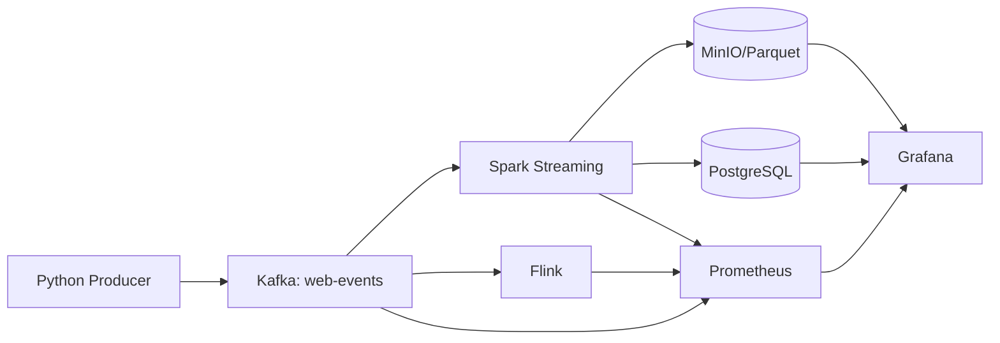

# Streaming Pipeline Documentation

Welcome to the **Real-time Streaming Pipeline** documentation. This project demonstrates a production-ready streaming data architecture using modern data engineering tools.

## 🎯 Project Overview

This pipeline implements a complete streaming data platform featuring:

- **Apache Kafka** as the event backbone
- **Spark Structured Streaming** for real-time analytics
- **Apache Flink** as an alternative stream processor
- **MinIO** for S3-compatible data lake storage
- **PostgreSQL** for low-latency analytical queries
- **Prometheus + Grafana** for comprehensive observability

## 🚀 Quick Links

| Resource | Link |
|----------|------|
| **GitHub Repository** | [github.com/yourusername/streaming-pipeline](https://github.com/yourusername/streaming-pipeline) |
| **Docker Hub Images** | [hub.docker.com](https://hub.docker.com/) |
| **Issue Tracker** | [GitHub Issues](https://github.com/yourusername/streaming-pipeline/issues) |

## 📖 Documentation Structure

- **[Architecture](architecture/overview.md)** - System design and data flow
- **[Getting Started](getting-started/quick-start.md)** - Deploy in minutes
- **[Components](components/producer.md)** - Detailed component guides
- **[Monitoring](monitoring/prometheus.md)** - Observability setup
- **[Testing](testing/verification.md)** - Validation procedures
- **[Troubleshooting](troubleshooting.md)** - Common issues and fixes

## 🏁 Quick Start

```bash
# 1. Start the stack
docker compose up -d --build

# 2. Run the producer
cd producer && pip install -r requirements.txt && python producer.py --create-topic

# 3. Submit Spark job
docker exec -it spark-master spark-submit \
  --master spark://spark-master:7077 \
  --packages org.apache.spark:spark-sql-kafka-0-10_2.12:3.5.0,... \
  /opt/spark-apps/structured_streaming.py

# 4. View dashboards
open http://localhost:3000  # Grafana (admin/admin123)
```

## 🏗️ Architecture at a Glance



## ✨ Key Features

- **Real-time Processing**: Sub-second latency from event to dashboard
- **Exactly-Once Semantics**: Checkpointing and idempotent writes
- **Multi-Sink Output**: Data lake (Parquet) + operational DB (PostgreSQL)
- **Dual Engine Support**: Choose Spark, Flink, or run both
- **Production Ready**: Health checks, monitoring, alerting, graceful shutdown
- **Single Command Deploy**: `docker compose up -d`

## 📊 Dashboards Preview

### Web Events Overview
Business metrics: events/sec, unique users, revenue, errors, consumer lag

### Processing Metrics
Technical metrics: batch latency, throughput, checkpoint stats, resource usage

## 🛠️ Technology Stack

| Layer | Technology | Version |
|-------|------------|---------|
| Messaging | Apache Kafka | 7.5.0 |
| Stream Processing | Spark Structured Streaming | 3.5.0 |
| Stream Processing (Alt) | Apache Flink | 1.18.1 |
| Object Storage | MinIO | 2024-01-16 |
| Relational DB | PostgreSQL | 16 |
| Metrics | Prometheus | 2.48.0 |
| Visualization | Grafana | 10.2.2 |
| Producer | Python + confluent-kafka | 3.11+ |

## 📝 License

MIT License - see [LICENSE](../LICENSE) for details.

---

*Built for learning and production streaming architectures*